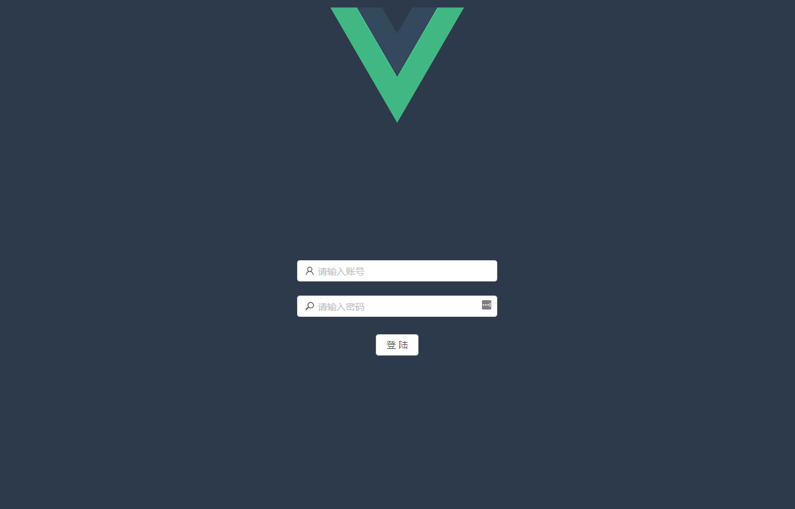

# jindouyunERP 筋斗云管理系统

`jindouyunERP` 是一个前后端分离的管理系统，采用 GoFrame + Vue 开发。

- 后端仓库(本仓库) https://github.com/Guovin/jindouyunERP
- 前端仓库 https://github.com/Guovin/jindouyun-vue

## 开发技术

- 后端：GoFrame、Mysql
- 前端：Vue、Ant Design Vue

## 主要功能及效果图

- 登陆、注销
- 修改密码
- 员工管理：添加单条记录，删除单条记录，保存单条记录，一键保存所有记录




## 本地运行

### 后端

安装Mysql，创建一个Database，下载本仓库源码：
```bash
git clone https://github.com/Guovin/jindouyunERP.git
```

进入源码目录查看并修改config目录下的config.toml配置文件(Mysql连接信息)。
运行项目，会自动初始化并创建相关数据表。

### 前端

下载前端仓库源码：
```bash
git clone https://github.com/Guovin/jindouyun-vue.git
```

前端Vue采用Vue-cli4构建，并使用yarn管理组件包。

运行：
```bash
cd jindouyun-vue
yarn serve
```

然后打开浏览器访问 http://localhost:8080/